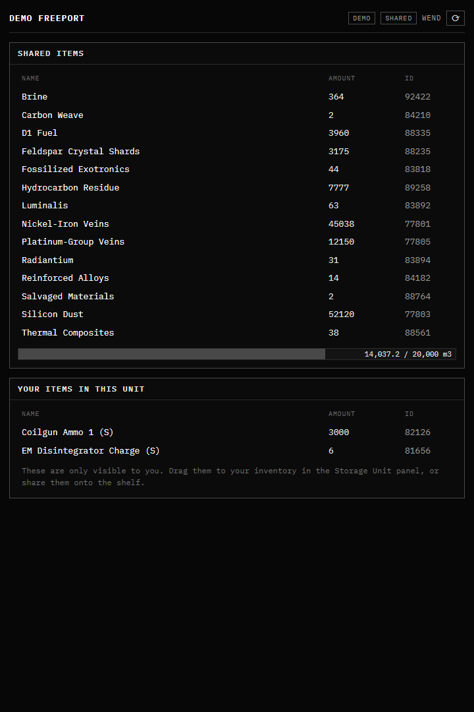
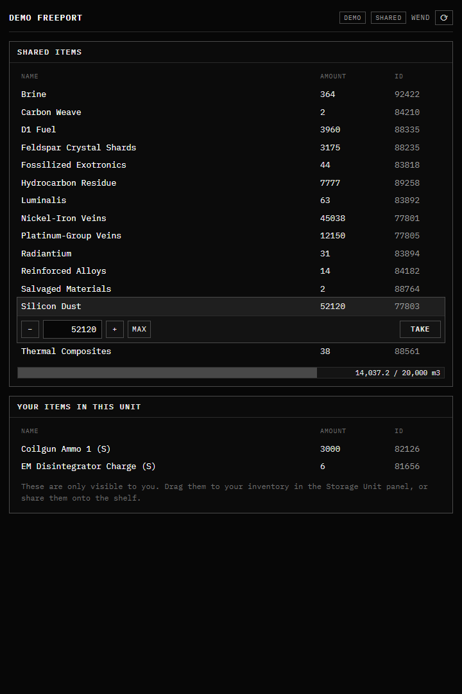
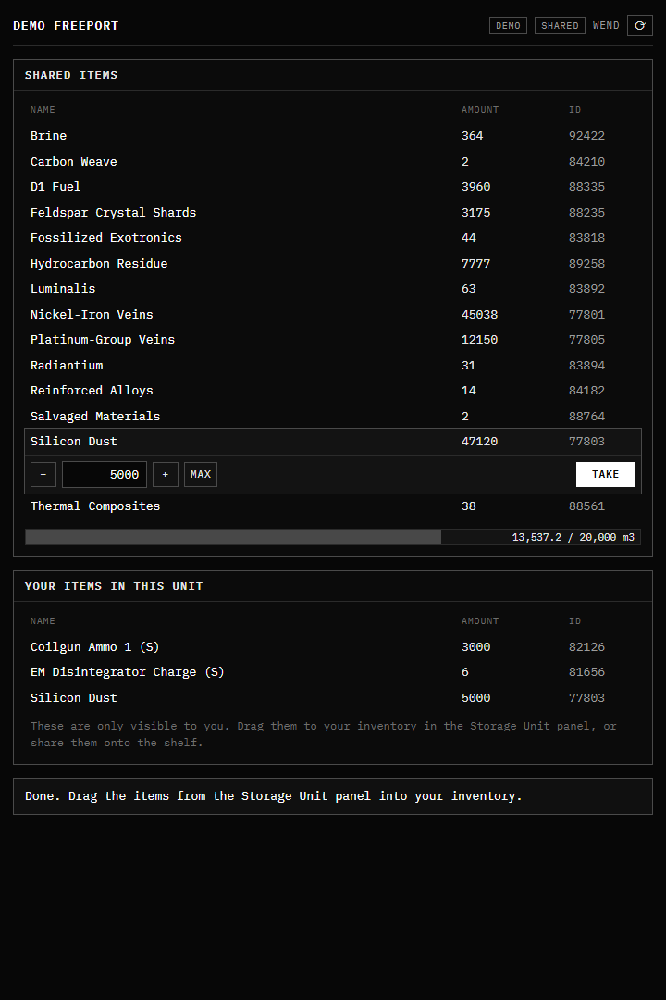

# SSU Open Shared Withdraw

A minimal EVE Frontier Smart Storage Unit dApp for a **shared open shelf**,
built to look and feel like the game's own storage interface. The design
principle: *the storage unit's main hangar IS the shared shelf.*

- **Owner**: drags items in and out of the unit in game, exactly as normal.
  Zero dApp interaction to stock or reclaim. One-time "Enable shared access"
  click authorizes the extension.
- **Anyone else**: sees everything in the unit listed in the behavior panel
  (NAME / AMOUNT / ID, like the game's default view). Click a row → quantity
  stepper → **Take** → the items land in their own slot ("STORAGE UNIT" panel
  in game) → drag them into their inventory.
- **Depositing**: drag items into the STORAGE UNIT panel in game (they go to
  your own slot), then press **Share** in the dApp to move them onto the
  shelf.

Live deployment: <https://ssu-open-shared-withdraw.pages.dev>
(`?demo=1` renders canned data with simulated transactions — no wallet or
chain access needed; useful for previews and screenshots.)



## How it works on chain

`move/ssu_open_claim` publishes a `ClaimAuth` extension witness. Once the
owner authorizes it (`storage_unit::authorize_extension`), the module exposes:

| Function | Who signs | What it does |
|---|---|---|
| `take(su, character, type_id, qty)` | any character | main hangar → caller's owned slot (`withdraw_item<ClaimAuth>` + `deposit_to_owned<ClaimAuth>`; sender must own the character) |
| `put(su, character, cap, type_id, qty)` | any character | caller's owned slot → main hangar (`withdraw_by_owner<Character>` + `deposit_item<ClaimAuth>`) |
| `authorize(su, owner_cap)` | unit owner | enables shared access (single extension slot: replaces any other dApp's witness) |
| `claim_from_open` / `stock_open` / `share_to_open` | — | v2 legacy (open-inventory shelf); kept for upgrade compatibility, and the app still drains open-inventory leftovers on take |

Key world-contract facts this relies on (v0.0.24, `testnet_stillness`):

- An authorized extension may deposit/withdraw the **main** inventory with
  just the witness — no OwnerCap. That is what lets the main hangar be the
  shelf.
- `deposit_to_owned` lazily creates the per-character slot; the game shows
  that slot to its owner in the STORAGE UNIT panel and lets them drag items
  out (burn to game).
- A StorageUnit has **one** extension slot (`swap_or_fill`): authorizing this
  dApp replaces e.g. Trinary Exchange on that unit, and vice versa. The app
  warns the owner before replacing a foreign extension. Never call
  `freeze_extension_config` — it is one-way.
- Volumes/capacities on chain are m³ × 100; each bucket carries its own
  `used_capacity` / `max_capacity`, which the app renders as the game-style
  capacity bar.

## Current testnet deployment

- Environment: `testnet_stillness`, world package
  `0x8b8a46ed766fa1358ce7c5c51f6a164b13d627a63e45343f69ed0ba0446c1aa1`
- Claim package **v3** (adds `take` / `put`):
  `0x37bf31ff7ce1e5ddc91b038153f0f3488ca4ab311a0d972a305c9f9bcccc46e3`
- Original id (v1, the witness's defining id — never changes):
  `0x4defff877661097a0fdfac67a87dc6e23f37b1664cff81bb166037a34930f610`
- UpgradeCap: `0x62e423dee9a9247248489e8ff61aba08578fa24f3ee2e6427844f7a232095f05`
  (held by the operator CLI address)

Upgrades: `sui client upgrade move/ssu_open_claim` (CLI ≥ the network's
protocol version; `suiup install sui@testnet` to refresh), then copy the new
`published-at` from `move/ssu_open_claim/Published.toml` into
`VITE_CLAIM_PACKAGE_ID` and redeploy the app. Authorized units keep working
without re-authorization (witness identity is anchored to v1).

## App

Vite + React + `@evefrontier/dapp-kit` in `app/`. Reads go through the public
Sui GraphQL endpoint (paginated dynamic-field walk in `src/unitState.ts`);
item names come from `app/src/data/typeNames.json` (a typeId -> name map
extracted from the game client's type table, regenerated on patch day), with
the world API (`/v2/types/{id}`) as a fallback for ids the map lacks. The
world API stopped listing new content in mid-2026, so the bundled map is what
keeps newer items from rendering as "type 95988".

```powershell
pnpm install
pnpm --dir app build          # tsc + vite build
sui move test --path move/ssu_open_claim
npx wrangler pages deploy dist --project-name ssu-open-shared-withdraw --branch main  # from app/
```

URL parameters (all optional, first match wins for the unit):

- `storageUnitId` / `objectId` / `assemblyId` / `ssu` — Sui object id of the
  unit (bake this into the URL you set on the unit).
- `itemId` + `tenant` — appended automatically by the in-game browser; the
  dapp-kit resolves them to the object id.
- `characterId` — manual override for local testing.
- `demo=1` — canned data, simulated transactions.

Set the unit's dApp URL (in game: Edit Assembly → dApp URL, or on chain via
`storage_unit::update_metadata_url`, owner-signed) to:

```
https://ssu-open-shared-withdraw.pages.dev/?storageUnitId=<unit object id>
```

The `?storageUnitId=` part is REQUIRED — the game does not pass the unit to
custom dApp URLs on its own.

## Owner setup

1. Open the dApp on the unit (in game, or in a browser with EVE Vault and
   `?storageUnitId=`).
2. Connect the owner wallet → the banner offers **Enable shared access**
   (one transaction; the unit's OwnerCap id is read from the unit object).
3. Drag stock into the unit in game. Done — visitors can take, and anything
   they share lands in the main hangar where you see it natively.

## Screenshots

| | |
|---|---|
|  |  |

`docs/screenshots/shot-prod-real.png` shows the deployed app reading a live
third-party unit (read-only, foreign extension notice).

## Verified in game (2026-07-11 smoke tests)

- The dApp loads in the BEHAVIOR panel; the in-game wallet connects and
  auto-reconnects, and signs custom extension transactions (authorize
  succeeded; the wallet pays gas — sponsorship doesn't cover custom calls).
- **The game does NOT append `?itemId=` to custom dApp URLs** (despite the
  builder docs): the URL set on the unit MUST carry the unit id itself,
  `?storageUnitId=0x…`. The in-app `itemId` derivation is kept in case CCP
  changes this.
- The in-game wallet reports transaction success WITHOUT a digest field —
  never treat a missing digest as failure (transactions.ts).
- The wallet may carry PlayerProfiles from retired cycles; the character
  lookup filters by the current world package (src/usePlayerCharacter.ts).
- The dapp-kit's own resolver needs `VITE_EVE_WORLD_PACKAGE_ID` set — it
  throws without it.
- The 8s poll picks up in-game drags in and out without manual refresh.
- Owner detection: the unit's OwnerCap is owned by the character OBJECT
  (AddressOwner whose address is the character id on the GraphQL schema).
- Owners can disable shared access again (Owner setup → Disable; calls
  `storage_unit::revoke_extension_authorization`).

## Still to verify in game

- The full visitor flow (take + share) with a second character, and how
  promptly the game's STORAGE UNIT panel reflects a take.
